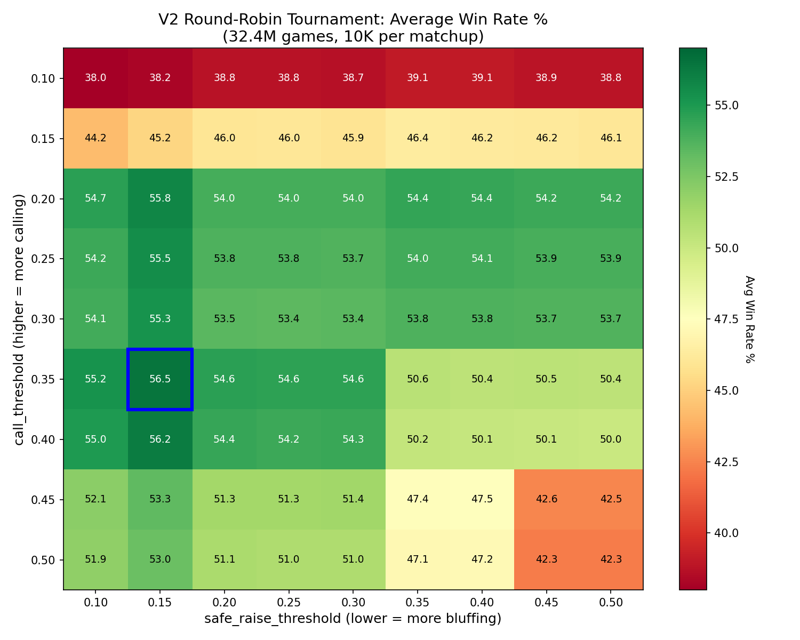
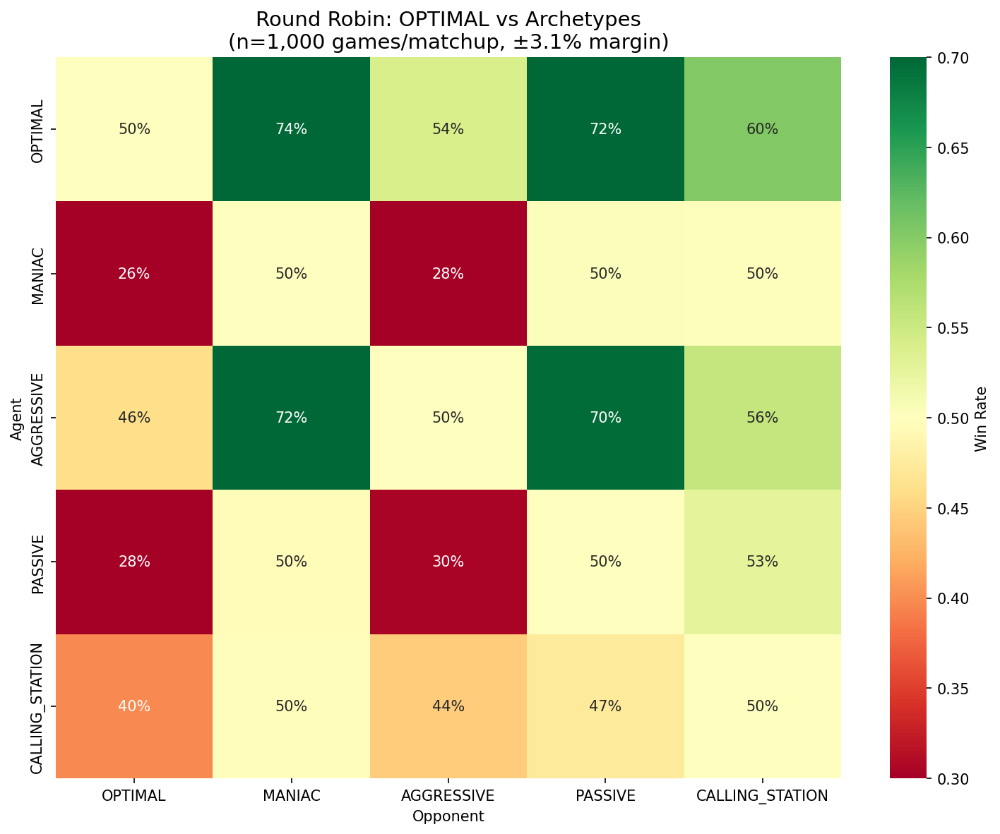

# Liar's Dice

A complete Liar's Dice game engine with a tournament-winning deterministic agent.

## Tournament Results

Optimal thresholds discovered via **32.4 million game round-robin tournament** (Nov 2025):

| Metric | Value |
|--------|-------|
| **Optimal Thresholds** | call=35%, raise=15% |
| **Win Rate** | 56.5% average across all opponents |
| **Dominance** | Beats 77/80 opponent configurations |



### OPTIMAL vs Archetypes



## Can You Beat It?

Think you can build a better Liar's Dice agent? Clone the repo and try:

```bash
git clone https://github.com/tanayvenkata/liars-dice.git
cd liars-dice
python play.py  # Play against OPTIMAL yourself
```

Or implement your own agent (see [Build Your Own Agent](#build-your-own-agent)) and run:

```python
from test_deterministic import run_tournament
from agents.deterministic_agent import create_personality_agent

my_agent = MyAgent("Challenger")
optimal = create_personality_agent("OPTIMAL")
results = run_tournament(my_agent, optimal, num_games=1000)
print(f"Your win rate: {results['agent1_win_rate']:.1%}")
```

**The bar to beat: 50%** - Can you consistently beat an agent that wins 56.5% against the field?

## Quick Start

```bash
# Clone and setup
git clone https://github.com/tanayvenkata/liars-dice.git
cd liars-dice
python3 -m venv .venv
source .venv/bin/activate
pip install -r requirements.txt

# Play!
python play.py
```

## Game Modes

```
==================================================
         LIAR'S DICE
==================================================

Select game mode:
  1. Play - Human vs Bot
  2. Watch - Bot vs Bot (verbose)
  3. Tournament - Fast head-to-head
```

## Personality Types

Five distinct playing styles based on threshold combinations:

| Personality | Call Threshold | Raise Threshold | Strategy |
|------------|----------------|-----------------|----------|
| **MANIAC** | 10% | 10% | Bluffs freely, never calls |
| **AGGRESSIVE** | 50% | 10% | Bluffs freely, calls everything |
| **PASSIVE** | 10% | 50% | Plays honest, never calls |
| **CALLING_STATION** | 50% | 50% | Plays honest, calls everything |
| **OPTIMAL** | 35% | 15% | Tournament winner (default) |

## How It Works

### Decision Logic

```
1. If best raise has P >= 15%: RAISE (safe)
2. Elif current bid has P < 35%: CALL (likely bluff)
3. Else: RAISE (forced bluff to survive)
```

Uses binomial probability: *What's the chance my opponent has enough dice to make this bid true?*

### The Math

```python
# P(opponent has at least k dice of face value)
def binomial_prob_at_least(n, k, p=1/6):
    return sum(C(n,i) * p**i * (1-p)**(n-i) for i in range(k, n+1))
```

## Game Rules

Liar's Dice is a bluffing game:

1. Each player starts with 5 dice, rolled secretly
2. Players take turns bidding on the **total** dice showing a face value
3. Bid format: "3 fours" = "at least 3 dice showing 4 across all players"
4. Each bid must raise: higher quantity OR same quantity + higher face
5. Instead of bidding, call "LIAR!" to challenge
6. On challenge: reveal all dice
   - Bid met or exceeded: challenger loses a die
   - Bid not met: bidder loses a die
7. Lose all dice = lose the game

## Project Structure

```
liars-dice/
├── agents/
│   ├── base.py                # Agent interface
│   ├── human.py               # Human player input
│   └── deterministic_agent.py # Agent with optimal thresholds
├── game/
│   ├── engine.py              # Game rules and state management
│   ├── types.py               # Bid, Action, PlayerView dataclasses
│   └── prompts_v2.py          # Probability calculations
├── results/
│   ├── tournament_heatmap.png      # 32.4M game threshold sweep
│   └── optimal_vs_archetypes.png   # 5x5 archetype round robin
├── play.py                    # Interactive CLI
├── test_deterministic.py      # Agent test suite
├── visualize.py               # Tournament visualization
├── stats_utils.py             # Statistical utilities
└── requirements.txt
```

## Build Your Own Agent

Implement the `Agent` interface:

```python
from agents.base import Agent
from game.types import PlayerView, Action, ActionType, Bid

class MyAgent(Agent):
    def get_action(self, view: PlayerView) -> Action:
        # view.own_dice - your dice values
        # view.current_bid - bid to beat (or None if opening)
        # view.opponent_dice_count - how many dice opponent has
        # view.total_dice - total dice in play

        # Return either a bid or a call:
        return Action(ActionType.BID, bid=Bid(quantity=2, face_value=4))
        # or
        return Action(ActionType.CALL)

    def notify_round_result(self, result: RoundResult) -> None:
        # Called after each round with revealed dice
        pass
```

Test against the built-in agents:

```python
from agents.deterministic_agent import create_personality_agent
from game.engine import GameEngine

my_agent = MyAgent("MyBot")
opponent = create_personality_agent("OPTIMAL")

engine = GameEngine(starting_dice=5)
engine.initialize_game(num_players=2)
# ... run games
```

## Visualization

Generate tournament visualizations:

```bash
python visualize.py
```

## License

MIT
